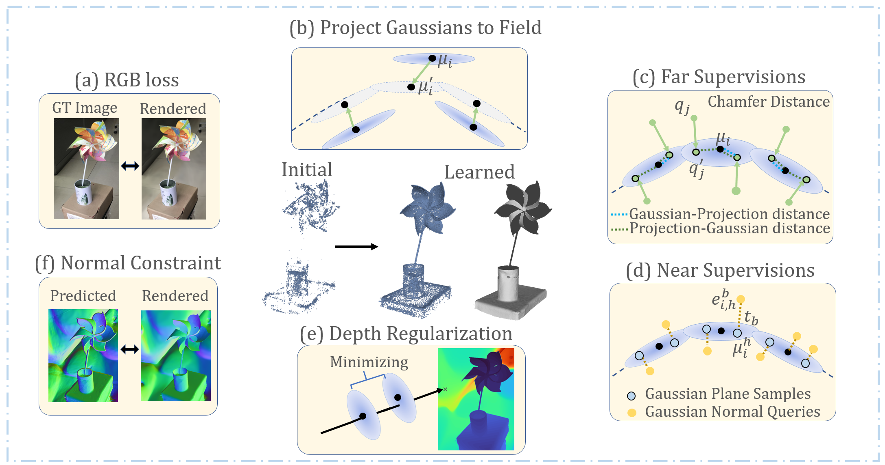

<h1 align="center">GaussianUDF: Inferring Unsigned Distance Functions through 3D Gaussian Splatting</h1>
<p align="center" style="font-size:25px;color:blue" > CVPR 2025 Highlight</p>
<p align="center" style="font-size:16px" >
    <strong>Shujuan Li</strong></a>
    ·
    <a href="https://yushen-liu.github.io/"><strong>Yu-Shen Liu</strong></a>
    ·
    <a href="https://h312h.github.io/"><strong>Zhizhong Han</strong></a>
</p>
<p align="center" style="font-size:25px"><a href="https://arxiv.org/abs/2503.19458">Paper</a> | <a href="https://lisj575.github.io/GaussianUDF/">Project Page</a></p>

<div align="center"></div>
<div align="center"></div>
<p align="center">
    
</p>


# Preprocessed Datasets & Pretrained Meshes

Our preprocessed datasets are provided in [This link](https://drive.google.com/drive/folders/1u0gox3ipzyKuHMxfTKnJkFdHsKRBuXCf?usp=drive_link). For [DTU dataset](https://drive.google.com/drive/folders/1SJFgt8qhQomHX55Q4xSvYE2C6-8tFll9), download the pair file for the warp loss. Please organize all files as follows:
```
data
├── deepfashion_rendering_fov60
│   ├── 30
│   │   ├── images
│   │   ├── mask
│   │   ├── sparse
│   │   ├── cameras_sphere.npz
│   │   ├── 30_pc_swap.ply
│   │   └── ...
│   ├──...
├── dtu
│   ├── scan24
│   │   ├── depths
│   │   ├── images
│   │   ├── mask
│   │   ├── sparse
│   │   └── cameras.npz
│   └── ...
├── DTU_GTpoints 
│   │   ├── Points
│   │   │   └── stl
│   │   └── ObsMask
│   └── ...
├── dtu_pair
│   ├── scan24
│   │   ├── pairs.txt
│   └── ...
```
Pretrained meshes are provided in [This link](https://drive.google.com/drive/folders/1u0gox3ipzyKuHMxfTKnJkFdHsKRBuXCf?usp=drive_link).

# Setup

## Installation

```shell
git clone git@github.com:lisj575/GaussianUDF.git
cd GaussianUDF

conda env create --file environment.yml
conda activate gs-udf

# extract udf
cd custom_mc
python setup.py build_ext --inplace
cd ..
```

# Training and Evaluation

```
# DF3D dataset
python run_df3d.py

# DTU 
python run_dtu.py
```


# Acknowledgements

This project is built upon [2DGS](https://github.com/hbb1/2d-gaussian-splatting), [Neural-Pull](https://github.com/mabaorui/NeuralPull) and [CAP-UDF](https://github.com/junshengzhou/CAP-UDF). We thank all the authors for their great repos.


# Citation

If you find our code or paper useful, please consider citing
```bibtex
@inproceedings{li2025gaussianudf,
  title={Gaussianudf: Inferring unsigned distance functions through 3d gaussian splatting},
  author={Li, Shujuan and Liu, Yu-Shen and Han, Zhizhong},
  booktitle={Proceedings of the Computer Vision and Pattern Recognition Conference},
  pages={27113--27123},
  year={2025}
}
```
